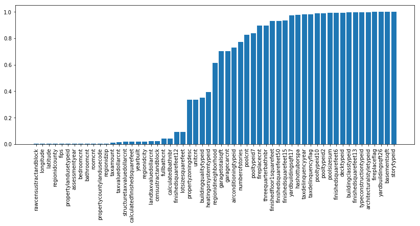
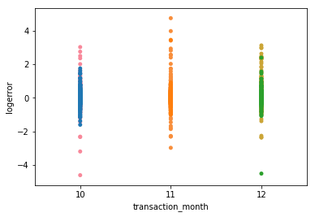
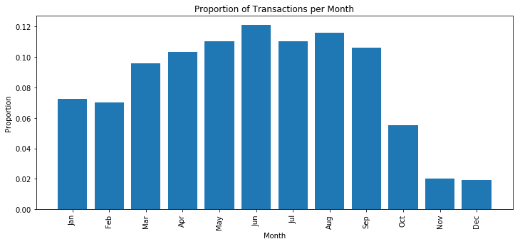
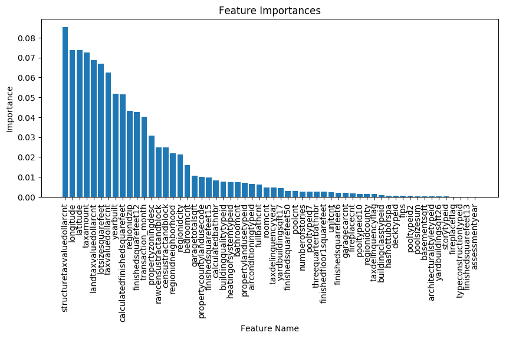

This Python 3 environment comes with many helpful analytics libraries installed
It is defined by the kaggle/python docker image: https://github.com/kaggle/docker-python
For example, here's several helpful packages to load in 

Import Libraries and Data:


```python
import numpy as np # linear algebra
import pandas as pd # data processing, CSV file I/O (e.g. pd.read_csv)
import matplotlib.pyplot as plt # data visualization
import datetime as dt
import seaborn as sns
from sklearn.preprocessing import LabelEncoder
from sklearn.ensemble import RandomForestRegressor
```

Input data files are available in the "../input/" directory.

Any results I write to the current directory are saved as output.


```python
#load training file
train = pd.read_csv("../input/train_2016_v2.csv", parse_dates=["transactiondate"])
print(train.head())
print('---------------------')
print(train.shape)
```

       parcelid  logerror transactiondate
    0  11016594    0.0276      2016-01-01
    1  14366692   -0.1684      2016-01-01
    2  12098116   -0.0040      2016-01-01
    3  12643413    0.0218      2016-01-02
    4  14432541   -0.0050      2016-01-02
    ---------------------
    (90275, 3)


Distribution of Target Variable:


```python
log_errors = train['logerror']
upper_lim = np.percentile(log_errors, 99.5)
lower_lim = np.percentile(log_errors, 0.5)
log_errors = log_errors.clip(lower=lower_lim, upper=upper_lim)
```


```python
plt.figure(figsize=(12,10))
plt.hist(log_errors, bins=300)
plt.title('Distribution of Target Variable (log-error)')
plt.ylabel('count')
plt.xlabel('log-error')
plt.show()
```


Log-errors are close to normally distributed around a 0 mean, but with a slightly positive skew. There are also a considerable number of outliers, I will explore whether removing these improves model performance.

Proportion of Missing Values in Each Column:


```python
#load property features/description file
prop = pd.read_csv("../input/properties_2016.csv")
print(prop.head())
print('---------------------')
print(prop.shape)
```

    /Users/marskar/anaconda3/lib/python3.6/site-packages/IPython/core/interactiveshell.py:2728: DtypeWarning: Columns (22,32,34,49,55) have mixed types. Specify dtype option on import or set low_memory=False.
      interactivity=interactivity, compiler=compiler, result=result)


       parcelid  airconditioningtypeid  architecturalstyletypeid  basementsqft  \
    0  10754147                    NaN                       NaN           NaN   
    1  10759547                    NaN                       NaN           NaN   
    2  10843547                    NaN                       NaN           NaN   
    3  10859147                    NaN                       NaN           NaN   
    4  10879947                    NaN                       NaN           NaN   
    
       bathroomcnt  bedroomcnt  buildingclasstypeid  buildingqualitytypeid  \
    0          0.0         0.0                  NaN                    NaN   
    1          0.0         0.0                  NaN                    NaN   
    2          0.0         0.0                  NaN                    NaN   
    3          0.0         0.0                  3.0                    7.0   
    4          0.0         0.0                  4.0                    NaN   
    
       calculatedbathnbr  decktypeid         ...           numberofstories  \
    0                NaN         NaN         ...                       NaN   
    1                NaN         NaN         ...                       NaN   
    2                NaN         NaN         ...                       NaN   
    3                NaN         NaN         ...                       1.0   
    4                NaN         NaN         ...                       NaN   
    
       fireplaceflag  structuretaxvaluedollarcnt  taxvaluedollarcnt  \
    0            NaN                         NaN                9.0   
    1            NaN                         NaN            27516.0   
    2            NaN                    650756.0          1413387.0   
    3            NaN                    571346.0          1156834.0   
    4            NaN                    193796.0           433491.0   
    
       assessmentyear  landtaxvaluedollarcnt  taxamount  taxdelinquencyflag  \
    0          2015.0                    9.0        NaN                 NaN   
    1          2015.0                27516.0        NaN                 NaN   
    2          2015.0               762631.0   20800.37                 NaN   
    3          2015.0               585488.0   14557.57                 NaN   
    4          2015.0               239695.0    5725.17                 NaN   
    
       taxdelinquencyyear  censustractandblock  
    0                 NaN                  NaN  
    1                 NaN                  NaN  
    2                 NaN                  NaN  
    3                 NaN                  NaN  
    4                 NaN                  NaN  
    
    [5 rows x 58 columns]
    ---------------------
    (2985217, 58)


```python
nans = prop.drop('parcelid', axis=1).isnull().sum()
nans.sort_values(ascending=True, inplace=True)
nans = nans / prop.shape[0]
#print(nans)
```


```python
plt.figure(figsize=(14, 5))
plt.bar(range(len(nans.index)), nans.values)
plt.xticks(range(len(nans.index)), nans.index.values, rotation=90)
plt.show()
```





There are several columns which have a very high proportion of missing values. It may be worth analysing these more closely.

Monthly Effects on Target Variable


```python
train['transaction_month'] = pd.DatetimeIndex(train['transactiondate']).month
train.sort_values('transaction_month', axis=0, ascending=True, inplace=True)
print(train.head())

ax = sns.stripplot(x=train['transaction_month'], y=train['logerror'])
```

          parcelid  logerror transactiondate  transaction_month
    0     11016594    0.0276      2016-01-01                  1
    4392  12379107    0.0276      2016-01-22                  1
    4391  12259947    0.0010      2016-01-22                  1
    4390  17204079    0.0871      2016-01-22                  1
    4389  12492292   -0.0212      2016-01-22                  1


For submission we are required to predict values for October, November and December. The differing distributions of the target variable over these months indicates that it may be useful to create an additional 'transaction_month' feature as shown above. Lets have a closer look at the distribution across only October, November and December.


```python
ax1 = sns.stripplot(x=train['transaction_month'][train['transaction_month'] > 9], y=train['logerror'])
```

Proportion of Transactions in Each Month


```python
trans = train['transaction_month'].value_counts(normalize=True)
trans = pd.DataFrame(trans)
trans['month'] = trans.index
trans = trans.sort_values('month', ascending=True)
trans.set_index('month')
trans.rename({'transaction_month' : ''})
print(trans)

months = ['Jan', 'Feb', 'Mar', 'Apr', 'May', 'Jun', 'Jul', 'Aug', 'Sep', 'Oct', 'Nov', 'Dec']

plt.figure(figsize=(12, 5))
plt.bar(range(len(months)), trans['transaction_month'])
plt.title('Proportion of Transactions per Month')
plt.ylabel('Proportion')
plt.xlabel('Month')
plt.xticks(range(len(months)), months, rotation=90)
plt.show()
```

        transaction_month  month
    1            0.072623      1
    2            0.070152      2
    3            0.095840      3
    4            0.103140      4
    5            0.110341      5
    6            0.120986      6
    7            0.110186      7
    8            0.116045      8
    9            0.106065      9
    10           0.055132     10
    11           0.020227     11
    12           0.019263     12








This datase contains more transactions occuring in the Spring and Summer months, although it must be noted that some transactions from October, November and December have been removed to form the competition's test set (thanks to nonrandom for pointing this out).

Feature Importance


```python
#fill NaN values with -1 and encode object columns 
for x in prop.columns:
    prop[x] = prop[x].fillna(-1)

#many more parcelids in properties file, merge with training file
train = pd.merge(train, prop, on='parcelid', how='left')
print(train.head())
print('---------------------')
print(train.shape)
```

       parcelid  logerror transactiondate  transaction_month  \
    0  11016594    0.0276      2016-01-01                  1   
    1  12379107    0.0276      2016-01-22                  1   
    2  12259947    0.0010      2016-01-22                  1   
    3  17204079    0.0871      2016-01-22                  1   
    4  12492292   -0.0212      2016-01-22                  1   
    
       airconditioningtypeid  architecturalstyletypeid  basementsqft  bathroomcnt  \
    0                    1.0                      -1.0          -1.0          2.0   
    1                   -1.0                      -1.0          -1.0          1.0   
    2                   -1.0                      -1.0          -1.0          1.0   
    3                   -1.0                      -1.0          -1.0          4.0   
    4                    1.0                      -1.0          -1.0          1.0   
    
       bedroomcnt  buildingclasstypeid         ...           numberofstories  \
    0         3.0                 -1.0         ...                      -1.0   
    1         2.0                 -1.0         ...                      -1.0   
    2         3.0                 -1.0         ...                      -1.0   
    3         4.0                 -1.0         ...                       2.0   
    4         3.0                 -1.0         ...                      -1.0   
    
       fireplaceflag  structuretaxvaluedollarcnt  taxvaluedollarcnt  \
    0             -1                    122754.0           360170.0   
    1             -1                     37095.0           185481.0   
    2             -1                    137012.0           240371.0   
    3             -1                    373100.0           746200.0   
    4             -1                     40729.0            61709.0   
    
       assessmentyear  landtaxvaluedollarcnt  taxamount  taxdelinquencyflag  \
    0          2015.0               237416.0    6735.88                  -1   
    1          2015.0               148386.0    3051.73                  -1   
    2          2015.0               103359.0    5707.91                  -1   
    3          2015.0               373100.0    8576.10                  -1   
    4          2015.0                20980.0    1056.92                  -1   
    
       taxdelinquencyyear  censustractandblock  
    0                -1.0         6.037107e+13  
    1                -1.0         6.037532e+13  
    2                -1.0         6.037541e+13  
    3                -1.0         6.111008e+13  
    4                -1.0         6.037571e+13  
    
    [5 rows x 61 columns]
    ---------------------
    (90275, 61)


```python
for c in train[['transactiondate', 'hashottuborspa', 'propertycountylandusecode', 'propertyzoningdesc', 'fireplaceflag', 'taxdelinquencyflag']]:
    label = LabelEncoder()
    label.fit(list(train[c].values))
    train[c] = label.transform(list(train[c].values))

x_train = train.drop(['parcelid', 'logerror', 'transactiondate'], axis=1)
y_train = train['logerror']
```


```python
print(x_train.head())
print('------------')
print(y_train.head())
```

       transaction_month  airconditioningtypeid  architecturalstyletypeid  \
    0                  1                    1.0                      -1.0   
    1                  1                   -1.0                      -1.0   
    2                  1                   -1.0                      -1.0   
    3                  1                   -1.0                      -1.0   
    4                  1                    1.0                      -1.0   
    
       basementsqft  bathroomcnt  bedroomcnt  buildingclasstypeid  \
    0          -1.0          2.0         3.0                 -1.0   
    1          -1.0          1.0         2.0                 -1.0   
    2          -1.0          1.0         3.0                 -1.0   
    3          -1.0          4.0         4.0                 -1.0   
    4          -1.0          1.0         3.0                 -1.0   
    
       buildingqualitytypeid  calculatedbathnbr  decktypeid         ...           \
    0                    4.0                2.0        -1.0         ...            
    1                    7.0                1.0        -1.0         ...            
    2                    7.0                1.0        -1.0         ...            
    3                   -1.0                4.0        -1.0         ...            
    4                    7.0                1.0        -1.0         ...            
    
       numberofstories  fireplaceflag  structuretaxvaluedollarcnt  \
    0             -1.0              0                    122754.0   
    1             -1.0              0                     37095.0   
    2             -1.0              0                    137012.0   
    3              2.0              0                    373100.0   
    4             -1.0              0                     40729.0   
    
       taxvaluedollarcnt  assessmentyear  landtaxvaluedollarcnt  taxamount  \
    0           360170.0          2015.0               237416.0    6735.88   
    1           185481.0          2015.0               148386.0    3051.73   
    2           240371.0          2015.0               103359.0    5707.91   
    3           746200.0          2015.0               373100.0    8576.10   
    4            61709.0          2015.0                20980.0    1056.92   
    
       taxdelinquencyflag  taxdelinquencyyear  censustractandblock  
    0                   0                -1.0         6.037107e+13  
    1                   0                -1.0         6.037532e+13  
    2                   0                -1.0         6.037541e+13  
    3                   0                -1.0         6.111008e+13  
    4                   0                -1.0         6.037571e+13  
    
    [5 rows x 58 columns]
    ------------
    0    0.0276
    1    0.0276
    2    0.0010
    3    0.0871
    4   -0.0212
    Name: logerror, dtype: float64


```python
rf = RandomForestRegressor(n_estimators=30, max_features=None)

rf.fit(x_train, y_train)

rf_importance = rf.feature_importances_


importance = pd.DataFrame()
importance['features'] = x_train.columns
importance['importance'] = rf_importance
print(importance.head())
```

                       features  importance
    0         transaction_month    0.040122
    1     airconditioningtypeid    0.006390
    2  architecturalstyletypeid    0.000250
    3              basementsqft    0.000293
    4               bathroomcnt    0.007432


```python
importance.sort_values('importance', axis=0, inplace=True, ascending=False)

print('------------')
print(importance.head())
```

    ------------
                          features  importance
    50  structuretaxvaluedollarcnt    0.085142
    25                   longitude    0.073641
    24                    latitude    0.073609
    54                   taxamount    0.072549
    53       landtaxvaluedollarcnt    0.068523


```python
fig = plt.figure(figsize=(10, 4), dpi=100)
plt.bar(range(len(importance)), importance['importance'])
plt.title('Feature Importances')
plt.xlabel('Feature Name')
plt.ylabel('Importance')
plt.xticks(range(len(importance)), importance['features'], rotation=90)
plt.show()
```





Here we see that the greatest importance in predicting the log-error comes from features involving taxes and geographical location of the property. Notably, the 'transaction_month' feature that was engineered earlier was the 12th most important feature. 


```python
test= test.rename(columns={'ParcelId': 'parcelid'}) 
#To make it easier for merging datasets on same column_id later
```


    ---------------------------------------------------------------------------

    NameError                                 Traceback (most recent call last)

    <ipython-input-30-1e807e847848> in <module>()
    ----> 1 test= test.rename(columns={'ParcelId': 'parcelid'})
          2 #To make it easier for merging datasets on same column_id later


    NameError: name 'test' is not defined


# Analyse the Dimensions of our Datasets


```python
     print("Training Size:" + str(train.shape))
     print("Property Size:" + str(prop.shape))
     print("Sample Size:" + str(test.shape))
```
